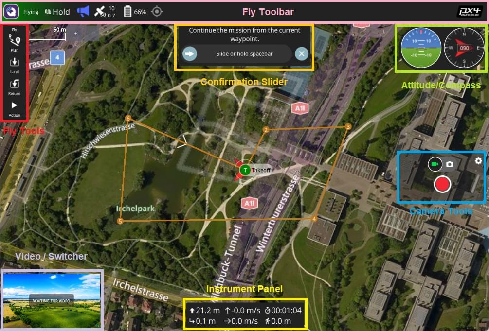
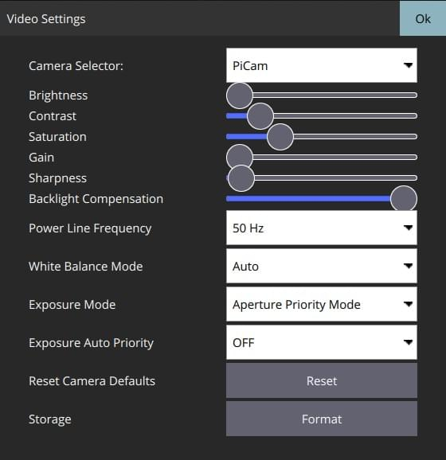
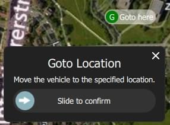

# Uçuş Ekranı

Uçuş Ekranı, aracı uçarken izlemek ve araca komut vermek için kullanılır.

Şunları yapmak için kullanabilirsiniz:

- Otomatik şekilde [pre-flight checklist](#preflight_checklist) çalıştırın.
- Görevleri kontrol edin: [start](#start_mission), [continue](#continue_mission), [pause](#pause), ve [resume](#resume_mission).
- Aracı [arm](#arm)/[disarm](#disarm)/[emergency stop](#emergency_stop), [takeoff](#takeoff)/[land](#land), [change altitude](#change_altitude), belirli bir konuma [go to](#goto) veya [orbit](#orbit), ve [return/RTL](#rtl) için yönlendirin.
- Harita görünümü ile video görünümü (eğer varsa) arasında geçiş yapın
- Mevcut araç için video, görev, telemetri ve diğer bilgileri görüntüleyin ve ayrıca bağlı araçlar arasında geçiş yapın.

## İzleme

Yukarıdaki ekran görüntüsü, uçuş ekranının ana öğelerini gösterir:

- **Harita:** Bağlı tüm araçların pozisyonlarını ve mevcut aracın görevini gösterir. 
  - Haritada gezinmek için haritayı sürükleyebilirsiniz (harita belirli bir süre sonra otomatik olarak yeniden ortalanır).
  - Kalkıştan sonra, haritaya tıklayarak bir konuma [Go to](#goto) veya [Orbit at](#orbit) ayarlayabilirsiniz.
- **Uçuş Araç Çubuğu:** Sensörler (GPS, pil, RC kontrolü) ve araç durumu (Uçuş modu, Etkin (armed) / Devre Dışı (disarmed) durumu) hakkında anahtar bilgiler. 
  - Daha fazla ayrıntı görmek için sensör göstergelerini seçin.
  - Yeni bir mod seçmek için * Flight mode * metnine (ör. "Hold") tıklayın. Tüm modlar mevcut olmayabilir.
  - Aracın uçuşa hazır olma durumunu değiştirmek için *Armed/Disarmed* metnine tıklayın. While flying you can press this text for *Emergency Stop*.
- **Uçuş araçları:** Şunları yapmak için kullanabilirsiniz: 
  - Kalkış/iniş arasında geçiş yapın.
  - Mevcut işlemi durdur/tekrar başlat (ör. iniş, ya da görev).
  - Güvenli geri dönüş (RTL ya da Return olarakta bilinir).
  - *Action* butonu mevcut durum için diğer uygun seçenekleri sunar (bunlar *Confirmation Slider*'ın üstünde gözükür). İşlemler, yüksekliği değiştirmeyi veya bir göreve devam etmeyi içerir.
  - [preflight checklist](#preflight_checklist)'i etkinleştirin (varsayılan olarak devre dışıdır).
- **[Bilgi Paneli](#instrument_panel):** Telemetri, kamera, video, sistem durumu ve titreşim dahil olmak üzere araç bilgilerini görüntüleyebileceğiniz çok sekmeli widget.
- **[Video/Harita](#video_switcher):** Bir pencerede video ile harita arasında geçiş yapın. 
  - *Video* ya da *Map*'i ön plana almak için öne almak istediğinize tıklayın.
  - *QGroundControl*, aracınızın UDP bağlantısı üzerinden RTP ve RTSP video yayını yapmanızı destekler. It also supports directly connected UVC devices. QGC'nin video desteği hakkında daha ayrıntılı bilgiyi [Video README](https://github.com/mavlink/qgroundcontrol/blob/master/src/VideoStreaming/README.md)'de bulabilirsiniz.
  - Bir [Telemetry Overlay](../FlyView/VideoOverlay.md) dosyası otomatik olarak oluşturulacaktır
- **Kaydırmalı Onay Butonu:** İstenen işlemi gerçekleştirmek için onay butonu. Operasyonu başlatmak için kaydırın. İptal etmek için **X** 'e basın.

Ayrıca varsayılan olarak görüntülenmeyen/ belirli koşullarda görüntülenebilen bazı öğelerde var. Mesela, çoklu-araç seçici sadece birden çok aracınız varsa veya uçuş öncesi kontrol listesi eğer etkinleştirilmişse görüntülenir.

## Bilgi Paneli {#instrument_panel}

Bilgi Paneli, telemetri, kamera, video, sistem durumu ve titreşim bilgileri dahil olmak üzere mevcut araç hakkında bilgileri görüntüleyebileceğiniz çok sekmeli bir widgettır.

The default page displays vehicle telemetry - use the drop down menu on the top right to select the other options.

### Değerler (Telemetri)

Değerler sayfası telemetri bilgilerini gösterir; varsayılan olarak rakım (ev konumuna göre) ve yer hızı.

Panelin sol üst köşesindeki küçük dişli simgesine basarak hangi bilgilerin görüntüleneceğini ayarlayabilirsiniz. Her değeri ister normal isterse "büyük" boyutta görüntülenebilir (normal boyutta sayfadaki her satırda 2 değer varken, büyük boyutta sadece 1 değer olur).

### Kamera {#camera_instrument_page}

Kamera sayfası, kamerayı ayarlamak ve kontrol etmek için kullanılır. Uçuş kontrolcüsüne direkt bağlı bir kamera için sadece kamerayı başlatma ayarı vardır:

[MAVLink Camera Protocol](https://mavlink.io/en/services/camera.html)'ü destekleyen bir kameraya bağlandığınızda ek olarak geçerli hale gelen diğer kamera özelliklerini ayarlayıp kullanabilirsiniz. Örnek olarak, eğer kameranız video modunu destekliyorsa, fotoğraf ve video modları arasında geçiş yapabilir, kaydı başlatıp/durdurabilirsiniz.

Gelişmiş ayarlara sayfanın sol üstündeki dişliye tıklayarak ulaşabilirsiniz.

::: info
Gösterilen ayarların çoğu kameraya bağlıdır (ayarlar [MAVLink Camera Definition File](https://mavlink.io/en/services/camera_def.html)'da tanımlanmıştır). Sondaki bir kaç ortak ayar sabit olarak kodlanmıştır: Fotoğraf Modu (Tekli/Photolapse), Fotoğraf Aralığı (Timelapse için), Kamera Ayarlarını Varsayılana Sıfırla (kameraya bir sıfırlama komutu gönderir), Format (depolama)
:::

### Video Akışı {#video_instrument_page}

Video sayfası video akışını etkinleştirmek ve devre dışı bırakmak için kullanılır. Etkinleştirildiğinde, video akışını durdurup başlatabilir, ızgara çizgilerini açabilir, görüntünün ekrana nasıl sığacağını değiştirebilir ve videoyu yerel olarak QGC ile kaydedebilirsiniz.

### Durum

Durum sayfası aracınızdaki sistemin durumunu gösterir. *QGroundControl* will switch to this page automatically if any system changes to unhealthy.

 

### Titreşim

Titreşim sayfası mevcut titreşim seviyelerini ve klips sayılarını gösterir.

## İşlemler/Görevler

Aşağıdaki bölümler, Uçuş Ekranı'nda genel işlemlerin / görevlerin nasıl gerçekleştirileceğini açıklamaktadır.

::: info
Mevcut seçeneklerin çoğu, hem aracın türüne hem de mevcut durumuna bağlıdır.
:::

### Uçuş Öncesi Kontrol Listesi {#preflight_checklist}

Aracın doğru ayarlandığını ve uçmak için güvenli olduğu gösteren standart kontrollerin yapılması için otomatik bir uçuş öncesi kontrol listesi kullanılabilir.

To view the checklist, first enable the tool by navigating to [Application Settings > General > Fly View](../SettingsView/General.md) and selecting the **Use preflight checklist** checkbox. Liste *Flight Tools*'a eklenecektir. Kontrol listesini oradan açabilirsiniz:

Once you have performed each test, select it on the UI to mark it as complete.

### Aracı Devreye Alma {#arm}

::: tip
Genel olarak * QGroundControl * aracı manuel olarak devreye almanızı gerektirmez; Bir göreve veya kalkışa başlarsanız bu sizin için yapılır.
:::

Bir aracı devreye almak, kalkışa hazırlık için motorları çalıştırır.

Aracı devreye almak için, *Fly Toolbar*'dan **Disarmed**'ı seçin ve kaydırmalı onay butonuyla onaylayın.

::: info
Eğer bir kaç saniye içinde kalkmazlarsa araçlar genellikle otomatik olarak kendilerini devre dışı bırakırlar.
:::

### Aracı Devre Dışı Bırakma {#disarm}

Aracı devre dışı bırakmak motorları durdurur (aracı güvenli hale getirir). Aracı devre dışı bırakmak için araç **landed** halindeyken *Fly Toolbar* 'dan **Armed**'ı seçin.

::: info
Aracı uçarken devre dışı bırakmak [Emergency Stop](#emergency_stop) olarak adlandırılır
:::

### Acil Durdurma {#emergency_stop}

Emergency stop is effectively the same as disarming the vehicle while it is flying. Aracınız çarpacaktır/çakılacaktır!

Aracı devre dışı bırakmak için uçuş sırasında *Fly Toolbar*'dan **Armed**'ı seçin.

### Kalkış {#takeoff}

::: tip
If you are starting a mission for a multicopter, *QGroundControl* will automatically perform the takeoff step.
:::

Kalkmak için (iniş yapıldığında):

1. *Fly Tools*'dan **Takeoff** butonuna basın (kalkıştan sonra bu buton **Land** butonu olarak değişecektir).
2. İsterseniz kalkış yüksekliğini sağda bulunan dikey kaydırıcıyla ayarlayabilirsiniz.
3. Kaydırmalı onay butonunu kaydırarak kalkışı onaylayın.

### İniş {#land}

Uçuş sırasında istediğiniz zaman mevcut konuma inebilirsiniz:

1. *Fly Tools*'dan **Land** butonuna basın (kalkıştan sonra bu buton **Takeoff** butonu olarak değişecektir).
2. Kaydırmalı onay butonunu kaydırarak inişi onaylayın.

### RTL/Geri Dönüş

Return to a "safe point" at any time while flying:

1. *Fly Tools*'dan **RTL** butonuna basın.
2. Kaydırmalı onay butonunu kaydırarak RTL'i onaylayın.

::: info
Vehicles commonly return to the "home" (takeoff) location and land. This behaviour depends on the vehicle type and configuration. For example, rally points or mission landings may be used as alternative return targets.
:::

### Yükleklik Değiştirme {#change_altitude}

Uçuş esnasında eğer bir görevde değilse aracın yükseliği değiştirilebilir:

1. *Fly Tools*'dan **Action** butonuna basın
2. İletişim kutusundan *Change Altitude*'ı seçin.
  
  

3. Dikey kaydırıcıyla istenilen yüksekliği ayarlayın, ardından kaydırmalı onay butonu ile onaylayın.
  
  

### Hedef Konum {#goto}

Kalkıştan sonra belirli bir konuma uçmayı ayarlayabilirsiniz.

1. Left click/Press on the map where you want the vehicle to move and select **Go to location** on the popup.
  
  

2. Konum harita üzerinde kaydırmalı onay butonuyla birlikte gözükecektir.
  
  

3. Hazır olduğunuzda kaydırarak onay verin (ya da **X**'e basarak iptal edin).

::: info
Hedef konum aracın 1 km çevresinde seçilmelidir (QGC'de sabit olarak ayarlanmıştır).
:::

### Yörünge Konumu {#orbit}

Kalkıştan sonra belirli bir konumun çevresinde yörüngede dolaşmasını ayarlayabilirsiniz.

1. Left click/Press on the map (near the centre of your desired orbit) and select **Orbit at location** on the popup.
  
  

2. Önerile yörünge kaydırmalı onay butonu ile harita üzerinde belirecektir.
  
  
  
  - Yörüngenin konumunu değiştirmek için merkezini seçin ve kaydırın.
  - Yörüngenin yarıçapını, çemberin dışındaki noktayı seçip sürükleyerek ayarlayabilirsiniz.
3. Hazır olduğunuzda kaydırarak onay verin (ya da **X**'e basarak iptal edin).

### Duraklatma

You can pause most operations, including taking off, landing, RTL, mission execution, orbit at location. Duraklatıldığında aracın davranışı aracın tipine bağlıdır, genellikle multikopterler havada asılı kalırken sabit kanatlar çember çizer.

::: info
Bir *Goto location* operasyonunu durduramazsınız.
:::

Durdurmak için:

1. *Fly Tools*'dan **Pause** butonuna basın.
2. İsterseniz yeni bir yüksekliği sağda bulunan dikey kaydırıcıyla ayarlayabilirsiniz.
3. Kaydırmalı onay butonunu kaydırarak durdurmayı onaylayın.

### Görevler

#### Görevi Başlatma {#start_mission}

Araç inmiş durumdayken bir görevi başlatabilirsiniz (görevi başlatma onay kaydıracı varsayılan olarak çoğu kez gösterilir).

Yerdeki bir aracın görevini başlatmak için:

1. *Fly Tools*'dan **Action** butonuna basın
2. İletişim kutusundan *Start Mission*'ı seçin.
  
  
  
      (kaydırmalı onay çubuğunu görüntülemek için)
      

3. Onay kaydıracı belirdiğinde görevi başlatmak için kaydırın.
  
  

#### Göreve Devam Etme (Continue Mission) {#continue_mission}

Göreve *sıradaki* hedef noktanızdan *devam* edebilirsiniz (*Continue Mission* kaydırmalı onay butonu kalkıştan sonra çoğu kez varsayılan olarak gösterilir).

::: info
Continue ve [Resume mission](#resume_mission) farklıdır! Continue komutu durdurulmuş bir görevi tekrar başlatmak veya zaten kalkmış bir araç için yani kalkış görevi komutunu kaçırmış durumdaysanız kullanılır. Resume mission is used when you've used a RTL or landed midway through a mission (e.g. for a battery change) and then wish to continue the next mission item (i.e. it takes you to where you were up to in the mission, rather than continuing from your place in the mission).
:::

Görevinize aşağıdakileri yaparak devam edebilirsiniz (hali hazırda bir görevde değilseniz!):

1. *Fly Tools*'dan **Action** butonuna basın
2. İletişim kutusundan *Continue Mission*'ı seçin.
  
  

3. Kaydırmalı onay butonunu kaydırarak göreve devam edin.
  
  

#### Göreve Devam Etme (Resume Mission) {#resume_mission}

*Resume Mission*, bir görevin içinde [RTL/Return](#rtl) ya da [Land](#land) gerçekleştirdikten sonra (ör. batarya değiştirmek için) kullanılır.

::: info
Eğer bataryayı değiştiricekseniz, bataryanın bağlantısını kestikten sonra QGC ile aracın bağlantısını **kesmeyin**. Yeni bataryayı yerleştirdikten sonra *QGroundControl* cihazı tekrar tespit edip, bağlantıyı otomatik olarak yeniden kuracaktır.
:::

İnişten sonra size görev planını cihazdan kaldırma, cihazda bırakma ya da göreve kaldığı yerden devam etme seçeneklerini sunan bir *Flight Plan complete* iletişim kutusu karşınıza çıkacaktır.

Eğer göreve devam etmeyi düşünüyorsanız, *QGroundControl* görevi yapılandırıp araca yükleyecektir. Ardından *Start Mission* kaydıracıyla göreve devam edebilirsiniz.

Aşağıdaki görüntü inişten sonra yeniden yapılandırılan bir görevi göstermektedir.

::: info
Bir görev, basit bir şekilde aracın son gerçekleştirdiği görev aşamasından devam edemez, çünkü son yapılan aşamada görevin sonraki aşamalarına etki edebilecek birden fazla etken olabilir (ör. hız komutları ya da kameranın kontrol komutları). Basit bir şekilde devam etmek yerine, *QGroundControl* son gerçekleştirilen görev aşamasından başlayarak, ilgili komutları da dikkate alarak görevi tekrar yapılandırır.
:::

#### İnişten Sonra Görevi Kaldırma {#resume_mission_prompt}

Görev bittikten sonra aracın inişi ve devre dışı bırakılmasının ardından görevi araçtan kaldırmanız istenecektir. Bunun amacı farkında olmadan araçta bırakılan görevlerin potansiyel olarak beklenmeyen davranışlar sergilemesinin önüne geçmektir.

### Videoyu Görüntüleme {#video_switcher}

Video akışı etkinleştirildiğinde, *QGroundControl* haritanın sol altında bulunan "videoya geçiş penceresi"nde videoyu göstermeye başlıyacaktır. You can press the switcher anywhere to toggle *Video* and *Map* to foreground (in the image below, the video is shown in the foreground).

::: info
video akışı [Application Settings > General tab > Video](../SettingsView/General.md#video)'dan etkinleştirilebilir/düzenlenebilir.
:::

Video görüntüsünü geçiş penceresindeki kontrolleri kullanararak daha da düzenleyebilirsiniz:

    
    

- Resize the switcher by dragging the icon in the top right corner.
- Geçiş penceresini sol alt köşede bulunan ikona basarak gizleyebilirsiniz.
- Sol üst köşedeki ikona basarak video geçiş pencersini ayırabilirsiniz. (ayrıldığında, işletim sisteminizdeki her hangi bir pencere gibi hareket ettirip tekrar boyutlandırabilirsiniz). Eğer ayrılan pencereyi kapatırsanız, geçiş penceresi tekrardan QGC uçuş görünüme sabitlenecektir.

### Video Kaydı

Eğer araç ve kamera tarafından destekleniyorsa, *QGroundControl* kendiliğinden video kaydını başlatıp durdurabilirsiniz. Ayrıca *QGroundControl* videoyu yayınlayıp, yerel dosyalara kaydedebilir.

::: tip
Kameranın kendisinde kaydedilen video daha kaliteli olacak olsa da, yüksek ihtimalle yer istasyonunun daha büyük kayıt kapasitesi olacaktır.
:::

#### Video Akışını Kaydetme (GCS'de)

Video akışı kaydı [video stream instrument page](#video_instrument_page)'dan kontrol edilir. Yeni bir video kaydı başlatmak için kırmızı daireye tıklayın (daireye her tıklanıldığında yeni bir video dosyası oluşturulur); kayıt devam ederken çember kırmızı bir kareye dönüşecektir.

Video akışı kaydı [Application Settings > General tab](../SettingsView/General.md)'dan düzenlenir:

- [Video Recording](../SettingsView/General.md#video-recording) - kayıt dosyası formatını ve depolama sınırlarını belirtir. 
  
  ::: info
  Videolar varsayılan olarak Matroska format (.mkv) olarak kaydedilir. Bu format, hata durumunda bozulmaya karşı nispeten dayanıklıdır.
  :::

- [Miscellaneous](../SettingsView/General.md#miscellaneous) - Video **Application Load/Save Path**'e kaydedilir. 

::: tip
Kaydedilen video, sadece video akışının kendisini içerir. QGroundControl uygulamasının öğeleriyle videoyu kaydetmek için başka bir ekran kaydı uygulaması kullanmanız gerekir.
:::

#### Videoyu Kamerada Kaydetme

*Kameranın kendisinde* video kaydını durdurup/başlatmak için [camera instrument page](#camera_instrument_page)'i kullanabilirsiniz. İlk olarak video moduna geçiş yapın, ardından kırmızı butona basarak kaydı başlatabilirsiniz.

