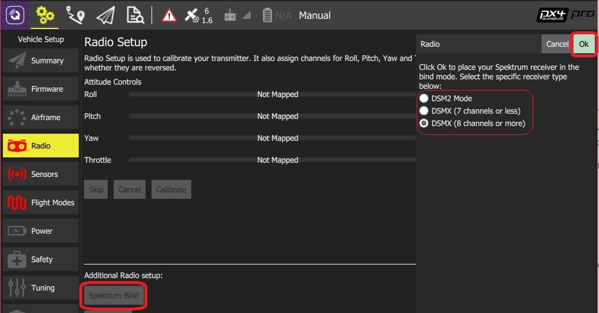

# Radyo Kurulumu

Radyo Kurulumu, ana vericinizin konum kontrol çubuklarını(dönüş, eğim, sapma, gaz kolu) kanallara eşlemesini yapılandırmak ve diğer tüm verici kontrolleri / RC kanalları için minimum, maksimum, trim ve geri ayarlarını kalibre etmek için kullanılır.

Ana kalibrasyon süreci PX4 ve ArduPilot için aynıdır (bazı ek uçuş kontrol cihazına özgü ayarlar / araçlar [ aşağıda ayrıntılı](#additional-radio-setup) olarak açıklanmıştır).

> **Note** Radyo sistemini kalibre etmeden önce, alıcı ve vericinin bağlanması gerekir. Bir alıcı ve verici çiftini bağlama işlemi donanıma özeldir ( talimatlar için kılavuzunuza bakın).

## Kalibrasyonun Yapılması

Kalibrasyon işlemi basittir - çubukları ekranın sağ üst köşesindeki verici diyagramında gösterilen belirli bir düzende hareket ettirmeniz istenecektir. Kalibrasonu tamamlamak için talimatları izlemeniz yeterlidir.

Radyoyu kalibre etmek için:

1. Üstteki araç çubuğundan **dişli** simgesini (Vechicle Setup), daha sonra kenar çubuğundan **Radio**'u seçin.
2. RC vericinizi açın.
3. Kalibrasyonu başlatmak için **OK**'a basın.
    
    
    
    > **Note** Yukardaki görüntü PX4 Pro içindir. Her iki aygıt yazılımı için kalibrasyon/üst bölüm aynıdır, ancak * Ek Radyo Ayarları * bölümü farklı olacaktır.

4. Verici yapılandırmanıza uyan radyo * verici modunu * seçin (bu, * QGroundControl * 'ın kalibrasyon sırasında izlemeniz için doğru çubuk pozisyonlarını görüntülemesini sağlar).
    
    

5. Çubukları metinde (ve verici görüntüsünde) belirtilen pozisyonlara hareket ettirin. Çubuklar doğru pozisyondayken ** Next ** tuşuna basın. Tüm pozisyonlar için tekrar edin.

6. When prompted, move all other switches and dials through their full range (you will be able to observe them moving on the *Channel Monitor*).

7. Press **Next** to save the settings.

Radio calibration is demonstrated in the [PX4 setup video here](https://youtu.be/91VGmdSlbo4?t=4m30s) (youtube).

## Additional Radio Setup

At the lower part of the *Radio Setup* screen is firmware-specific *Additional Radio setup* section. The options for each autopilot are shown below.

| PX4                                                                                                                               | ArduPilot                                                                                                                                     |
| --------------------------------------------------------------------------------------------------------------------------------- | --------------------------------------------------------------------------------------------------------------------------------------------- |
|  |  |

### Spectrum Bind (ArduPilot/PX4)

Before you can calibrate the radio system the receiver and transmitter must be connected/bound. If you have a *Spektrum* receiver you can put it in *bind mode* using *QGroundControl* as shown below (this can be particularly useful if you don't have easy physical access to the receiver on your vehicle).

To bind a Spektrum transmitter/receiver:

1. Select the **Spektrum Bind** button
2. Select the radio button for your receiver
3. Press **OK**
    
    

4. Power on your Spektrum transmitter while holding down the bind button.

### Copy Trims (PX4)

This setting is used to copy the manual trim settings from your radio transmitter so that they can be applied automatically within the autopilot. After this is done you will need to remove the manually set trims.

To copy the trims:

1. Select **Copy Trims**.
2. Center your sticks and move throttle all the way down. 
3. Press **Ok**.
    
    

4. Reset the trims on your transmitter back to zero.

### AUX Passthrough Channels (PX4)

AUX passthrough channels allow you to control arbitrary optional hardware from your transmitter (for example, a gripper).

To use the AUX passthrough channels:

1. Map up to 2 transmitter controls to separate channels. 
2. Specify these channels to map to the AUX1 and AUX2 ports respectively, as shown below. Values are saved to the vehicle as soon as they are set.
    
    

The flight controller will pass through the unmodified values from the specified channels out of AUX1/AUX2 to the connected servos/relays that drive your hardware.

### Param Tuning Channels (PX4)

Tuning channels allow you to map a transmitter tuning knob to a parameter (so that you can dynamically modify a parameter from your transmitter).

> **Tip** This feature is provided to enable manual in-flight tuning.

The channels used for parameter tuning are assigned in the *Radio* setup (here!), while the mapping from each tuning channel to its associated parameter is defined in the *Parameter editor*.

To set up tuning channels:

1. Map up to 3 transmitter controls (dials or sliders) to separate channels.
2. Select the mapping of *PARAM Tuning Id* to radio channels, using the selection lists. Values are saved to the vehicle as soon as they are set.
    
    

To map a PARAM tuning channel to a parameter:

1. Open the **Parameters** sidebar. 
2. Select the parameter to map to your transmitter (this will open the *Parameter Editor*).
3. Check the **Advanced Settings** checkbox.
4. Click the **Set RC to Param...** button (this will pop-up the foreground dialog displayed below)
    
    

5. Select the tuning channel to map (1, 2 or 3) from the *Parameter Tuning ID* selection list.

6. Press **OK** to close the dialog.
7. Press **Save** to save all changes and close the *Parameter Editor*.

> **Tip** You can clear all parameter/tuning channel mappings by selecting menu **Tools > Clear RC to Param** at the top right of the *Parameters* screen.