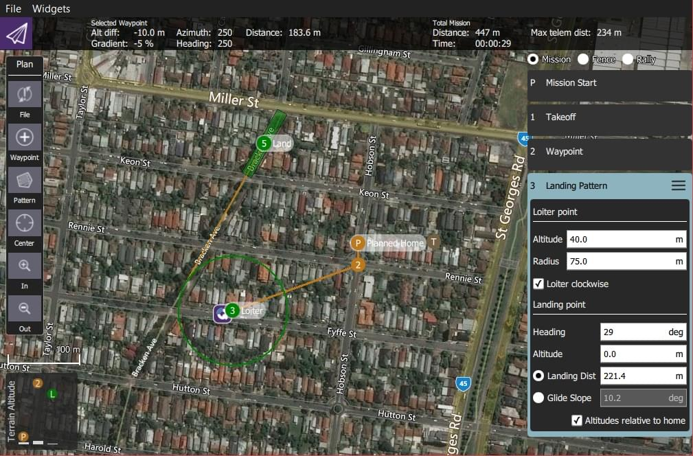
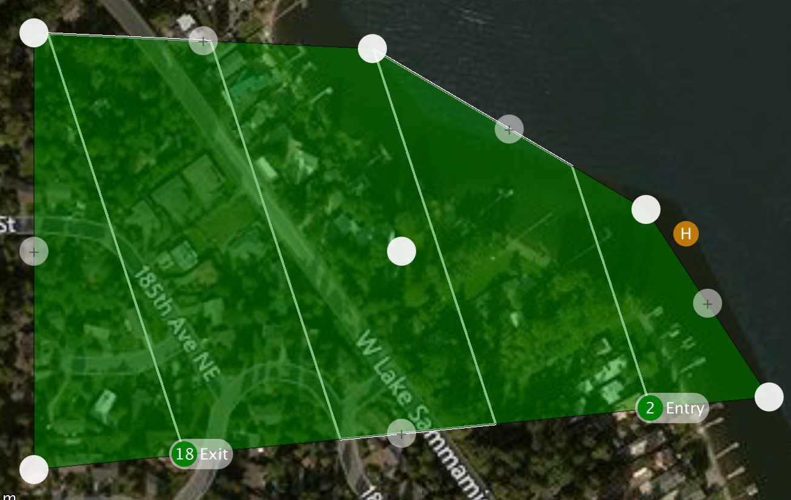

# QGroundControl v3.2 Release Notes (Detailed)

This topic contains a high level and _non-exhaustive_ list of new features added to _QGroundControl_ in version 3.2.

## Settings

### Telemetry log auto-save

If you have _Save telemetry log after each flight_ turned on you will no longer be prompted as to where to save the log each time the vehicle disarms. Logs will automatically be saved to the [Application Load/Save Path](../SettingsView/General.md#load_save_path)

For more information see [Settings > General (Miscellaneous)](../SettingsView/General.md#autosave_log).

### AutoLoad plans

If this setting is turned on, _QGroundControl_ will automatically upload a plan to the vehicle when it connects. The plan file must be named **AutoLoad#.plan** where the `#` is replaced with the vehicle id. The plan file must be located in the [Application Load/Save Path](../SettingsView/General.md#load_save_path).

For more information see [Settings > General (Miscellaneous)](../SettingsView/General.md#autoload_missions).

### Application Load/Save Path

You can now specify a save path which QGC will use as the default location to save files such as Parameters, Telemetry or Mission Plans.

For more information see [Settings > General (Miscellaneous)](../SettingsView/General.md#load_save_path).

### RTK GPS

You can now specify the _Survey in accuracy_ and _Minimum observation duration_ for use with a connected RTK GPS.

For more information see [Settings > General (RTK GPS)](../SettingsView/General.md#rtk_gps).

## Setup

### ArduPilot - Pre-Flight Barometer and Airspeed calibration

This is now supported from the Sensors page.

### ArduPilot - Copy RC Trims

This is now supported from the Copy Trims button on the Radio setup page.

## Plan View {#plan_view}

### Plan Files

Previous version of _QGroundControl_ saved missions, geo-fences and rally points in separate files (**.mission**, **.fence**, **.rally**). QGC now save all information related to a flight plan into a single file called a _Plan File_ with a file extension of **.plan**.

Information about the format can be found in [Plan File Format](https://dev.qgroundcontrol.com/en/file_formats/plan.html) (QGC Developer Guide).

### Plan Toolbar

The new _Plan Toolbar_ is displayed at the top of the [PlanView](../PlanView/PlanView.md). It shows you information related to the currently selected waypoint as well as statistics for the entire mission.

When connected to a vehicle it also shows an **Upload** button, which can be used to upload the plan to the vehicle.

### Mission Settings

The [Mission Settings](../PlanView/PlanView.md#mission_settings) panel allows you to specify values which apply to the entire mission, or settings you want to control right at the beginning of a mission. This is the first item in the mission list on the right of the screen.

#### Mission Defaults

##### Waypoint alt

This specifies the default altitude for newly added mission items. If you update this value while you have a mission loaded it will prompt you to update all the the waypoints to this new altitude.

##### Flight speed

This allows you to set the flight speed for the mission to be different than the default mission speed.

##### RTL after mission end

Check this if you want your vehicle to RTL after the final mission item.

#### Camera section

The camera section allows you to specify a camera action to take, control the gimbal and set your camera into photo or video mode.

The camera actions available are:

- Continue current action
- Take photos (time)
- Take photos (distance)
- Stop taking photos
- Start recording video
- Stop recording video

#### Vehicle Info section

When planning a mission the firmware being run on the vehicle as well as the vehicle type must be known in order for QGroundControl to show you the mission commands which are appropriate for your vehicle.

If you are planning a mission while you are connected to your vehicle the Firmware and Vehicle Type will be determined from the vehicle. If you are planning a mission while not connected to a vehicle you will need to specify this information yourself.

The additional value that can be specified when planning a mission is the vehicle flight speed. By specifying this value, total mission or survey times can be approximated even when not connected to a vehicle.

#### Planned Home Position

The planned home position allows you to simulate the vehicle's home position while planning a mission. This way you see the waypoint trajectory for your vehicle from takeoff to mission completion. Keep in mind that this is only the "planned" home position and you should place it where you plan to start the vehicle from. It has no actual impact on flying the mission. The actual home position of a vehicle is set by the vehicle itself when arming.

### New Waypoint features

- You can now adjust heading and flight speed for each waypoint.
- There is a camera section available for camera changes on each waypoint. Explanation of Camera Section can be read under Mission Settings above.

### Visual Gimbal direction

If you specify gimbal yaw changes on waypoints, both the plan and fly views will show you a visual representation of the gimbal direction.

### Pattern tool

There is a new _Pattern tool_. The following patterns are supported:

- Fixed Wing Landing (new)
- Survey (with new features)

#### Fixed Wing Landing Pattern

This adds a landing pattern for fixed wings to your mission. The first point of the pattern is the loiter point which commands to vehicle to loiter to a specific altitude. Once that altitude is reached, the vehicle will begin the landing sequence and fly down to the specified landing spot.

Both the loiter and land points can be dragged to adjust. Also all the various values associated with the pattern can be adjusted.

For more information see [Fixed Wing Landing Pattern](../PlanView/pattern_fixed_wing_landing.md).

#### Survey (new features)

- Images are not automatically taken in the turnaround zone outside of the polygonal survey area.
- There is a new _Hover and Capture_ option which can be used to capture the highest quality image at each image location. The vehicle will stop at each image location prior to taking the image such that the vehicle is stable while the image is taken.
- There is a new option to re-fly the survey grid at a 90 degree angle to the previous pass. This allows you to generate much denser coverage for the images.

Manipulating the survey area polygon is now easier to use on tablets with touch screens:

- You can drag the entire polygon to a new location by dragging the center point handle.
- Each polygon vertex can be dragged to a new location.
- To remove a polygon vertex, simple click on the drag handle for it.
- Click on the **+** handles to add a new vertex between two existing vertices.

## Fly View

### RTK GPS

RTK status is now shown in the toolbar.

### Arm/Disarm

There is an armed/disarmed indicator in the toolbar. You can click it to arm/disarm your vehicle. If you click Disarm in the toolbar while your vehicle is flying you will provided the option to Emergency Stop your vehicle.

### Guided Actions

- Takeoff
- Land
- RTL
- Pause
- Actions
  - Start Mission
  - Resume Mission
  - Change Altitude
  - Land Abort
- Direct interaction with map
  - Set Waypoint
  - Goto Location

#### Resume Mission

The Resume Mission guided action is used to resume a mission after performing an RTL from within the mission to perform a battery change. After the vehicle lands from RTL and you have disconnected the battery **do not** disconnect QGC from the Vehicle. Put in your new battery and QGC will detect the vehicle again and automatically restore the connection. Once this happens you will be prompted with a Resume Mission confirmation slider. If you want to resume the mission, confirm this and the mission will be rebuilt from your last waypoint traveled through. Once the mission is rebuilt you will be presented with another Resume Mission slide which allows you to review the rebuilt mission before starting it again. Confirm this Resume Mission slider to continue on with the mission.

###### How resume mission rebuilding works

In order to resume a mission you cannot simply continue it from the last mission item the vehicle ran. The reason is is that may skip over important change speed commands or camera control commands which are prior to that item in the mission. If you skipped over those the remainder of the mission will not run correctly. In order to make resume mission work correctly QGC rebuilds the mission looking backwards from the last mission item flown and automatically appends relevant commands to the front of the mission. By doing this the state of the mission prior to the resume point is restore. The following mission commands are the ones scanned for:

- `MAV_CMD_DO_CONTROL_VIDEO`
- `MAV_CMD_DO_SET_ROI`
- `MAV_CMD_DO_DIGICAM_CONFIGURE`
- `MAV_CMD_DO_DIGICAM_CONTROL`
- `MAV_CMD_DO_MOUNT_CONFIGURE`
- `MAV_CMD_DO_MOUNT_CONTROL`
- `MAV_CMD_DO_SET_CAM_TRIGG_DIST`
- `MAV_CMD_DO_FENCE_ENABLE`
- `MAV_CMD_IMAGE_START_CAPTURE`
- `MAV_CMD_IMAGE_STOP_CAPTURE`
- `MAV_CMD_VIDEO_START_CAPTURE`
- `MAV_CMD_VIDEO_STOP_CAPTURE`
- `MAV_CMD_DO_CHANGE_SPEED`
- `MAV_CMD_NAV_TAKEOFF`

### Remove mission after vehicle lands

You will be prompted to remove the mission from the vehicle after the mission completes and the vehicle lands and disarms. This is meant to prevent issues where stale missions are unknowingly left on a vehicle cause unexpected behavior.

### Instrument panel

#### Camera trigger

#### Flight Time

Flight time is now available for display in the instrument panel. For new users, flight time will be shown by default. For existing users who have already modified their instrument panel values you will have to add it yourself if you want to use it.

## [Analyze View](../analyze_view/index.md)

- [Log Download](../analyze_view/log_download.md) moved to _Analyze View_ from menu.
- New [GeoTag Images](../analyze_view/geotag_images.md) support for PX4 Pro firmware
- New [MAVLink Console](../analyze_view/mavlink_console.md) which provides access the the _nsh shell_ running on the vehicle.

## Multi-Vehicle View

There is a new view available when you have multiple vehicles connected to QGC. It will only show up when more than one vehicle is connected. When that happens you will see an additional set of radio button at the top right of the Plan view.

Click the **Multi-Vehicle** radio button to replace the instrument panel with the multi-vehicle list:

The example above shows three vehicles. The numbers are the vehicle id. In the large font is the current flight mode. You can click the flight mode name to change to a different flight mode. To the right are small version of the instruments for each vehicle. You can command the vehicle to do the following actions from the control panel:

- Arm/Disarm
- Start/Stop a mission
- Return to Launch
- Take Control back of the vehicle by returning to manual control from a mission.

### Multi-Vehicle Gotchas - Unique vehicle ids

Each vehicle connected to QGC must have a unique id. Otherwise QGC will think the vehicles are actually the same vehicle. The symptom of this is the Plan view jerking around as it tries to position itself to one vehicle and then the next. For PX4 Pro firmwares this is the `MAV_SYS_ID` parameter. For ArduPilot firmwares it is the `SYSID_THISMAV` parameter.

## Support for third-party customized QGroundControl

Standard QGC supports multiple firmware types and multiple vehicle types. There is now support in QGC which allows a third-party to create their own custom version of QGC which is targeted specifically to their custom vehicle. They can then release their own version of QGC with their vehicle.
